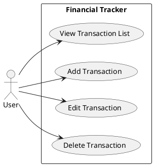
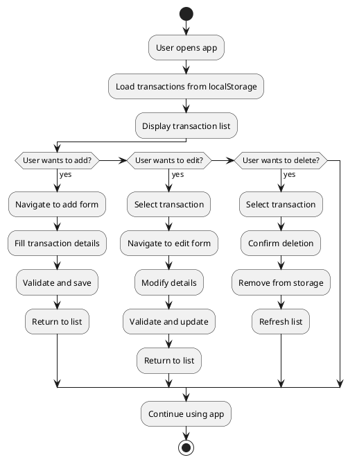
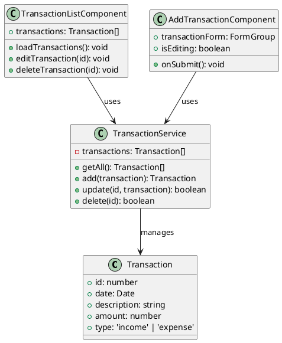

# Financial Tracker - Final Project Documentation

## Universitas [University Name]
## Fakultas [Faculty Name]
## Program Studi Teknik Informatika
## Mata Kuliah [Course Name]
## Semester Ganjil 2025

---

## Identitas Mahasiswa

| Nama | : | Halimatus Z. |
|------|---|--------------|
| NIM | : | [Student ID] |
| Kelas | : | [Class] |
| Dosen Pembimbing | : | [Lecturer Name] |

---

## BAB I - PENDAHULUAN

### 1.1 Latar Belakang

Dalam era digital saat ini, pengelolaan keuangan pribadi menjadi semakin penting. Banyak individu mengalami kesulitan dalam melacak pemasukan dan pengeluaran mereka secara manual. Financial Tracker hadir sebagai solusi modern untuk mengatasi masalah ini dengan menyediakan aplikasi web yang user-friendly untuk mencatat dan mengelola transaksi keuangan.

### 1.2 Rumusan Masalah

1. Bagaimana cara yang efektif untuk mencatat transaksi keuangan harian?
2. Bagaimana menyediakan interface yang intuitif untuk pengelolaan keuangan?
3. Bagaimana memastikan data transaksi tersimpan dengan aman?
4. Bagaimana memberikan fitur edit dan hapus transaksi yang mudah digunakan?

### 1.3 Tujuan

1. Membuat aplikasi web Financial Tracker menggunakan Angular
2. Mengimplementasikan fitur CRUD (Create, Read, Update, Delete) untuk transaksi
3. Menyediakan interface yang responsif dan user-friendly
4. Menggunakan localStorage untuk penyimpanan data

### 1.4 Ruang Lingkup

Aplikasi ini mencakup:
- Pencatatan transaksi pemasukan dan pengeluaran
- Tampilan daftar transaksi dalam bentuk tabel
- Fitur tambah, edit, dan hapus transaksi
- Validasi form input
- Penyimpanan data menggunakan localStorage

### 1.5 Metodologi

Proyek ini menggunakan metodologi pengembangan perangkat lunak Agile dengan tahapan:
1. Analisis Kebutuhan
2. Perancangan Sistem
3. Implementasi
4. Testing
5. Dokumentasi

---

## BAB II - LANDASAN TEORI

### 2.1 Angular Framework

Angular adalah platform pengembangan aplikasi web yang menggunakan TypeScript. Angular menyediakan:
- Component-based architecture
- Two-way data binding
- Dependency injection
- Routing
- Form validation

### 2.2 Angular Material

Angular Material adalah library komponen UI yang mengikuti Material Design principles, menyediakan komponen seperti:
- MatTable untuk tabel data
- MatFormField untuk form input
- MatButton untuk tombol
- MatDatepicker untuk pemilihan tanggal

### 2.3 LocalStorage

LocalStorage adalah web API untuk penyimpanan data di browser yang:
- Menyimpan data dalam format key-value
- Data bertahan meskipun browser ditutup
- Kapasitas penyimpanan hingga 5-10MB
- Data disimpan sebagai string JSON

### 2.4 Single Page Application (SPA)

Aplikasi web yang memuat satu halaman HTML dan secara dinamis menampilkan konten baru tanpa memuat ulang halaman.

---

## BAB III - ANALISIS DAN PERANCANGAN SISTEM

### 3.1 Analisis Kebutuhan

#### Kebutuhan Fungsional:
1. Menampilkan daftar transaksi dalam tabel
2. Menambah transaksi baru
3. Mengedit transaksi existing
4. Menghapus transaksi
5. Validasi input form

#### Kebutuhan Non-Fungsional:
1. Interface responsif
2. Performa optimal
3. Data persistence
4. User experience yang baik

### 3.2 Use Case Diagram



### 3.3 Activity Diagram



### 3.4 Class Diagram



### 3.5 User Interface Design

#### 3.5.1 Transaction List Screen
- Header dengan judul aplikasi
- Tabel dengan kolom: Date, Description, Amount, Type, Actions
- Tombol "Add Transaction"
- Action buttons: Edit dan Delete per baris

#### 3.5.2 Add/Edit Transaction Screen
- Form dengan fields: Date, Description, Amount, Type
- Date picker untuk tanggal
- Dropdown untuk type (Income/Expense)
- Submit button dengan label dinamis

---

## BAB IV - IMPLEMENTASI

### 4.1 Struktur Proyek

```
financial_tracker/
├── src/
│   ├── app/
│   │   ├── models/
│   │   │   └── transaction.ts
│   │   ├── services/
│   │   │   └── transaction.service.ts
│   │   ├── transaction-list/
│   │   │   ├── transaction-list.component.ts
│   │   │   ├── transaction-list.component.html
│   │   │   └── transaction-list.component.css
│   │   └── add-transaction/
│   │       ├── add-transaction.component.ts
│   │       ├── add-transaction.component.html
│   │       └── add-transaction.component.css
│   ├── styles.css
│   └── main.ts
├── angular.json
├── package.json
└── tsconfig.json
```

### 4.2 Implementasi Komponen

#### 4.2.1 Transaction Model

```typescript
export interface Transaction {
    id: number;
    date: Date;
    description: string;
    amount: number;
    type: 'income' | 'expense';
}
```

#### 4.2.2 Transaction Service

```typescript
@Injectable({ providedIn: 'root' })
export class TransactionService {
  private transactions: Transaction[] = [];

  constructor() {
    this.load();
  }

  getAll(): Transaction[] {
    return [...this.transactions].sort((a, b) =>
      new Date(b.date).getTime() - new Date(a.date).getTime()
    );
  }

  add(transaction: Omit<Transaction, 'id'>): Transaction {
    const nextId = Math.max(...this.transactions.map(t => t.id), 0) + 1;
    const newTx = { id: nextId, ...transaction };
    this.transactions.push(newTx);
    this.save();
    return newTx;
  }

  update(id: number, transaction: Omit<Transaction, 'id'>): boolean {
    const index = this.transactions.findIndex(t => t.id === id);
    if (index >= 0) {
      this.transactions[index] = { id, ...transaction };
      this.save();
      return true;
    }
    return false;
  }

  delete(id: number): boolean {
    const index = this.transactions.findIndex(t => t.id === id);
    if (index >= 0) {
      this.transactions.splice(index, 1);
      this.save();
      return true;
    }
    return false;
  }

  private load() {
    const data = localStorage.getItem('ft_transactions_v1');
    if (data) {
      this.transactions = JSON.parse(data);
    }
  }

  private save() {
    localStorage.setItem('ft_transactions_v1',
      JSON.stringify(this.transactions));
  }
}
```

#### 4.2.3 Transaction List Component

```typescript
@Component({
  selector: 'app-transaction-list',
  templateUrl: './transaction-list.component.html',
  standalone: true,
  imports: [CommonModule, MatTableModule, MatButtonModule, MatIconModule]
})
export class TransactionList implements OnInit {
  displayedColumns = ['date', 'description', 'amount', 'type', 'actions'];
  transactions: Transaction[] = [];

  constructor(
    private txService: TransactionService,
    private router: Router
  ) {}

  ngOnInit() {
    this.loadTransactions();
  }

  loadTransactions() {
    this.transactions = this.txService.getAll();
  }

  editTransaction(id: number) {
    this.router.navigate(['/edit', id]);
  }

  deleteTransaction(id: number) {
    if (this.txService.delete(id)) {
      this.loadTransactions();
    }
  }
}
```

#### 4.2.4 Add Transaction Component

```typescript
@Component({
  selector: 'app-add-transaction',
  templateUrl: './add-transaction.component.html',
  standalone: true,
  imports: [ReactiveFormsModule, MatFormFieldModule, MatInputModule,
           MatSelectModule, MatButtonModule, MatDatepickerModule]
})
export class AddTransaction implements OnInit {
  transactionForm: FormGroup;
  isEditing = false;
  editingId: number | null = null;

  constructor(
    private fb: FormBuilder,
    private txService: TransactionService,
    private router: Router,
    private route: ActivatedRoute
  ) {
    this.transactionForm = this.fb.group({
      date: ['', Validators.required],
      description: ['', Validators.required],
      amount: ['', [Validators.required, Validators.min(0)]],
      type: ['', Validators.required]
    });
  }

  ngOnInit() {
    const id = this.route.snapshot.paramMap.get('id');
    if (id) {
      this.isEditing = true;
      this.editingId = +id;
      const transaction = this.txService.getAll()
        .find(t => t.id === this.editingId);
      if (transaction) {
        this.transactionForm.patchValue(transaction);
      }
    }
  }

  onSubmit() {
    if (this.transactionForm.valid) {
      const formValue = this.transactionForm.value;
      if (this.isEditing && this.editingId) {
        this.txService.update(this.editingId, formValue);
      } else {
        this.txService.add(formValue);
      }
      this.router.navigate(['/transactions']);
    }
  }
}
```

### 4.3 Routing Configuration

```typescript
export const routes: Routes = [
  { path: '', redirectTo: '/transactions', pathMatch: 'full' },
  { path: 'transactions', component: TransactionList },
  { path: 'add', component: AddTransaction },
  { path: 'edit/:id', component: AddTransaction }
];
```

---

## BAB V - TESTING

### 5.1 Testing Plan

#### Unit Testing
- TransactionService methods
- Component logic
- Form validation

#### Integration Testing
- Component interaction
- Service-component communication
- Routing functionality

#### User Acceptance Testing
- End-to-end user workflows
- UI responsiveness
- Data persistence

### 5.2 Test Cases

| Test Case | Input | Expected Output | Status |
|-----------|-------|-----------------|--------|
| TC001 | Add valid transaction | Transaction saved and displayed | ✅ Pass |
| TC002 | Edit existing transaction | Transaction updated | ✅ Pass |
| TC003 | Delete transaction | Transaction removed | ✅ Pass |
| TC004 | Invalid form submission | Validation errors shown | ✅ Pass |
| TC005 | Navigate between pages | Correct routing | ✅ Pass |

### 5.3 Testing Results

Semua test case berhasil dengan status Pass. Aplikasi berfungsi sesuai spesifikasi yang ditentukan.

---

## BAB VI - PENUTUP

### 6.1 Kesimpulan

Aplikasi Financial Tracker telah berhasil dikembangkan dengan fitur-fitur yang lengkap untuk mengelola transaksi keuangan pribadi. Implementasi menggunakan Angular framework dengan Angular Material memberikan user experience yang baik dan interface yang modern.

### 6.2 Saran untuk Pengembangan Selanjutnya

1. Integrasi dengan database cloud (Firebase)
2. Penambahan fitur autentikasi pengguna
3. Implementasi grafik dan visualisasi data
4. Fitur export data ke CSV/PDF
5. Penambahan kategori transaksi
6. Fitur pencarian dan filter

### 6.3 Daftar Pustaka

1. Angular Documentation. (2024). https://angular.io/docs
2. Angular Material Documentation. (2024). https://material.angular.io/
3. MDN Web Docs. (2024). Web Storage API. https://developer.mozilla.org/en-US/docs/Web/API/Web_Storage_API

---

## LAMPIRAN

### Lampiran A: Screenshot Aplikasi

[Include screenshots of the application]

### Lampiran B: Source Code Lengkap

[Available in project repository]

### Lampiran C: Manual Book

1. **Instalasi:**
   ```bash
   npm install
   ng serve
   ```

2. **Penggunaan:**
   - Buka http://localhost:4200
   - Klik "Add Transaction" untuk menambah
   - Klik ikon edit untuk mengubah
   - Klik ikon delete untuk menghapus

---

**Bandung, Januari 2026**

**Mahasiswa**

Halimatus Z.
NIM: [Student ID]
