# Financial Tracker - Complete Project Documentation

## Project Overview

The Financial Tracker is a modern Angular web application designed for personal finance management. It allows users to track income and expenses with a clean, intuitive interface built using Angular Material components.

**Current Version Features:**
- ✅ Transaction CRUD operations (Create, Read, Update, Delete)
- ✅ Material Design UI with responsive table
- ✅ Form validation and date picker
- ✅ Local storage persistence
- ✅ Edit existing transactions
- ✅ Dynamic button labels ("Add Transaction" / "Save Changes")
- ✅ Horizontal action buttons layout

## Architecture Overview

### System Architecture Diagram

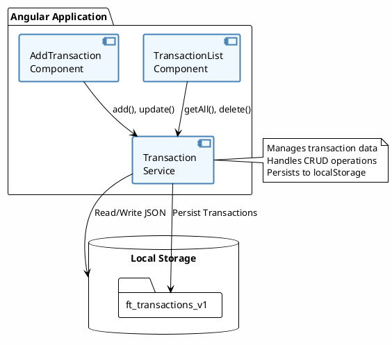

### Component Architecture Diagram

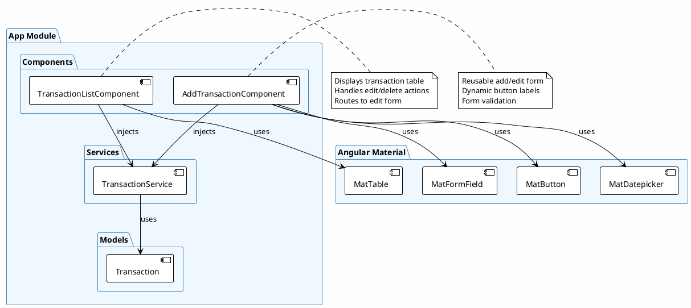

## Data Flow Diagrams

### Add Transaction Flow

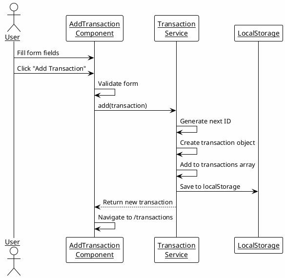

### Edit Transaction Flow

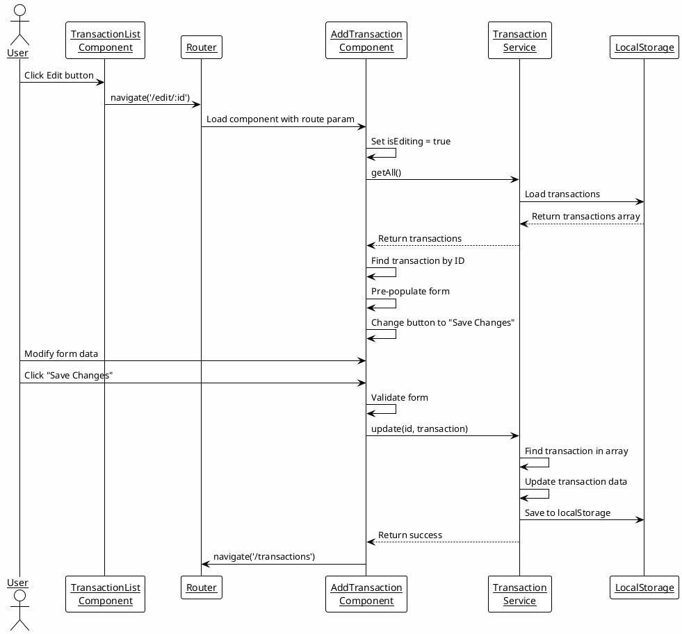

### Delete Transaction Flow

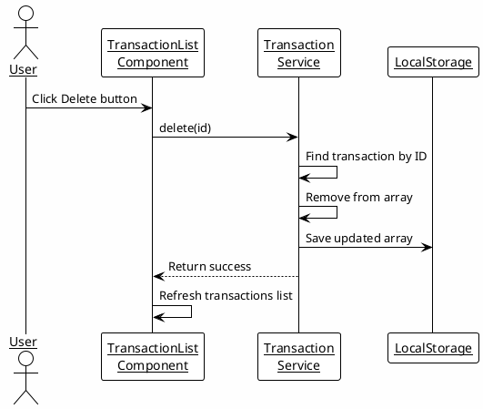

## Class Diagrams

### Transaction Model

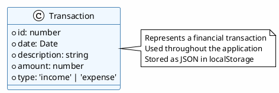

### TransactionService Class

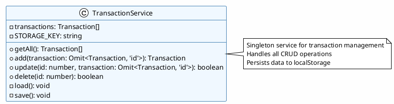

### Component Classes

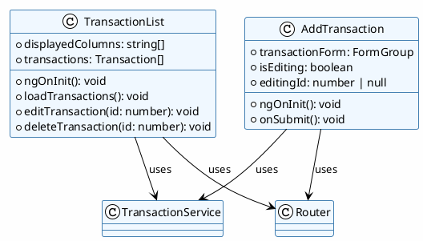

## User Interface Diagrams

### Main Transaction List

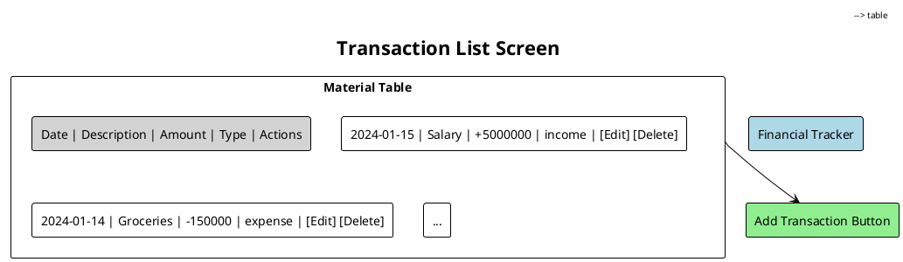

### Add/Edit Transaction Form

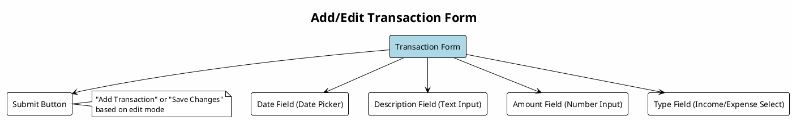

## Database Schema

### LocalStorage Structure

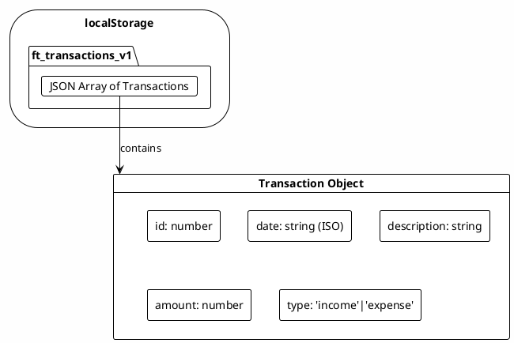

## Routing Diagram

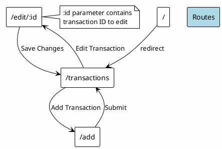

## Technology Stack

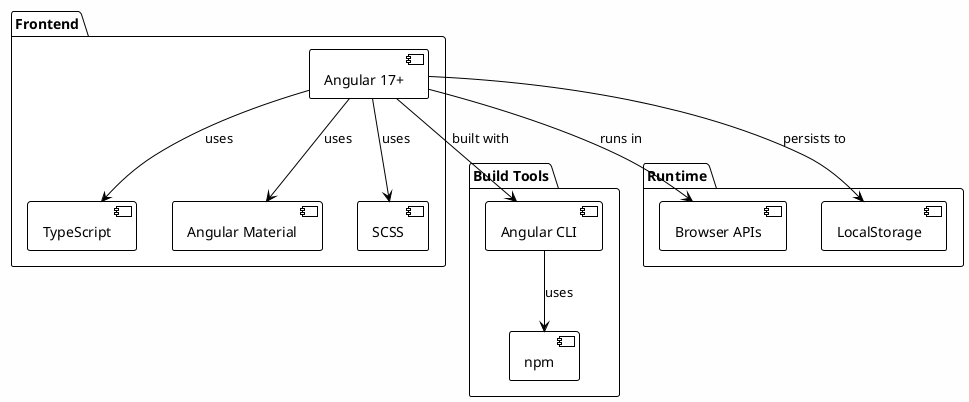

## Development Workflow

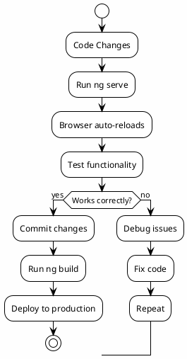

## File Structure

```
financial_tracker/
├── src/
│   ├── app/
│   │   ├── app.config.ts
│   │   ├── app.routes.ts
│   │   ├── app.component.ts/html/css
│   │   ├── models/
│   │   │   └── transaction.ts
│   │   ├── services/
│   │   │   └── transaction.service.ts
│   │   ├── transaction-list/
│   │   │   ├── transaction-list.component.ts/html/css
│   │   └── add-transaction/
│   │       └── add-transaction.component.ts/html/css
│   ├── styles.css
│   └── main.ts
├── angular.json
├── package.json
├── tsconfig.json
└── docs/
    └── projectDoc.pdf
```

## Key Code Snippets

### Transaction Service Methods

```typescript
// Add new transaction
add(transaction: Omit<Transaction, 'id'>): Transaction {
  const nextId = this.transactions.reduce((m, t) => Math.max(m, t.id), 0) + 1;
  const newTx: Transaction = {
    id: nextId,
    ...transaction
  };
  this.transactions.push(newTx);
  this.save();
  return newTx;
}

// Update existing transaction
update(id: number, transaction: Omit<Transaction, 'id'>): boolean {
  const idx = this.transactions.findIndex(t => t.id === id);
  if (idx >= 0) {
    this.transactions[idx] = { id, ...transaction };
    this.save();
    return true;
  }
  return false;
}
```

### Component Interaction

```typescript
// Edit transaction navigation
editTransaction(id: number): void {
  this.router.navigate(['/edit', id]);
}

// Dynamic form submission
onSubmit(): void {
  if (this.transactionForm.valid) {
    const formValue = this.transactionForm.value;
    if (this.isEditing && this.editingId) {
      this.txService.update(this.editingId, formValue);
    } else {
      this.txService.add(formValue);
    }
    this.router.navigate(['/transactions']);
  }
}
```

## Future Enhancements

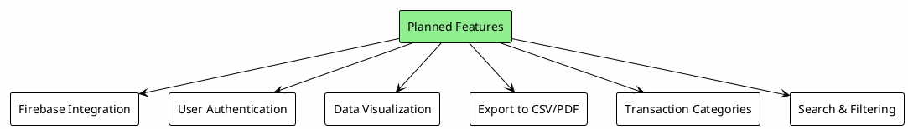

## Testing Strategy

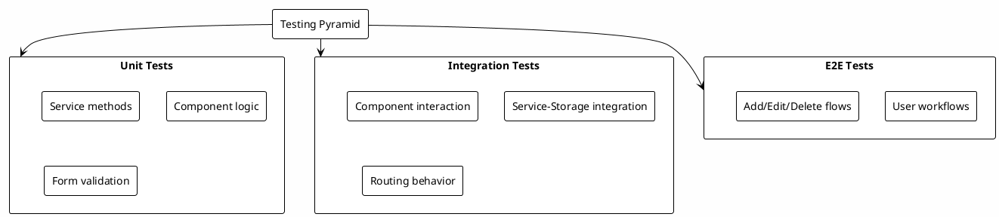

## Deployment Diagram

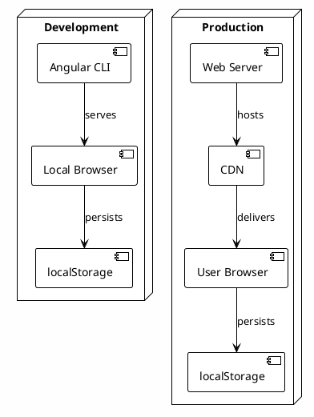

---

**Document Version:** 2.0
**Last Updated:** January 24, 2026
**PlantUML Version:** Compatible with PlantUML 1.2023.0+
